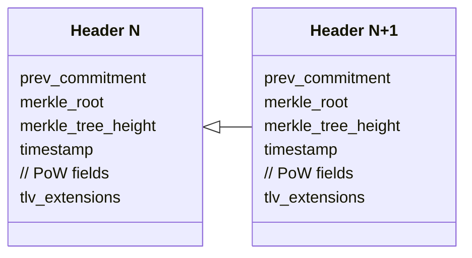
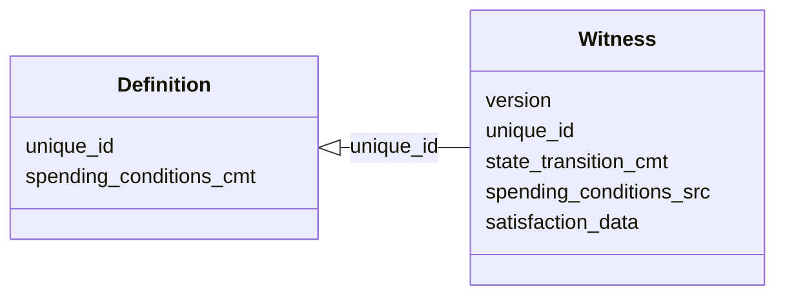

# Scaling and anonymizing Bitcoin at layer 1 with client-side validation

*Maxim Orlovsky, LNP/BP Standards Association*

## Abstract

In the paper, we propose a way to upgrade Bitcoin layer 1 (blockchain/timechain) without a required softfork. The upgrade leverages properties of client-side validation, can be gradual, has a permissionless deployment option (i.e. not requiring majority support or miner cooperation) and will have the scalability of the order $O(\log N)$ (no zk-proofs) or $O(1)$ (with zk proofs), where $N$ is a global number of transactions. It also offers higher privacy (absence of publically available ledger, transaction graphs, addresses, keys, signatures) and bounded Turing-complete programmability with a rich state provided by RGB or another client-side-validated smart contract system.

## Terms & Definitions

The word *Bitcoin* has acquired multiple meanings, thus we distinguish them by using more specific terms. We use **Bitcoin** as a generic umbrella term denoting the system as a whole, which may include multiple layers (including some future) and the overall idea of the peer-to-peer electronic cash system originating from Satoshi Nakamoto. At the same time, we use **BTC** to denote Bitcoin as a digital scarcity, money and currency. We also distinguish Bitcoin **PoW consensus** (the rule of selecting the next block producer), **Nakamoto consensus** (which includes PoW consensus enhanced with cryptoeconomic means of miner punishment), Bitcoin **blockchain** (alternatively named **timechain**) as a specific current implementation of Bitcoin layer 1 and **Bitcoin protocol (BP)** as a set of standards, technologies and tools for working with bitcoin transactions on-chain (in any possible layer 1).

## Background & Motivation

The original implementation of Bitcoin by Satoshi Nakamoto brought the strange idea that everybody needs to verify transactions for the whole world. This idea received the name of **blockchain**, or, sometimes, **timechain** - which became a euphemism for a ledger with public access. Introduction of the ledger has created two problems: absence of scalability and poor privacy; the first prevents adoption and networking effect from happening; the other contradicts the original cypherpunk spirit of Bitcoin and represents a strategic civilizational risk (see [Inevitability of cypherpunk for a proper civilization](https://dr.orlovsky.ch/blog/inevitability-of-cypherpunk-for-a-proper-civilization) and [Cyphernox Manifesto](https://dr.orlovsky.ch/blog/cyphernox-manifesto)).

Scalability and, partially, privacy problems were later addressed by the introduction of layer 2 systems, like Lightning network and other proposed solutions. Among those, the least fruitful was the idea of sidechain, which inherited most (if not all) of the original blockchain technology limitations while solving only a problem of low programmability, created a sandbox for experiments and, partially, some aspects of privacy.  Lightning network - a more successful layer 2 solution which is already deployed and operational - has its own scalability issues due to the need for liquidity over-collateralization, limitations of the gossip traffic throughput (both leading to the network centralization) and decreased security/trustlessness under high base layer conditions [..]. Other proposed alternatives, like Ark, require several base layer changes (one or two softforks), which presents challenges for the deployment. Finally, none of the existing or proposed second-layer solutions solves the original Bitcoin base layer privacy issues, - and other privacy-focused layer-1 solutions (like CoinJoin) still do not protect from legal authorities and introduce additional BTC fungibility problems.

Thus, it can be concluded that it is the ledger-based blockchain approach for building layer 1 which has to be fully rethought in order to solve the above problems. The first ideas in this space came with Peter Todd's works in 2016 [..] where he pointed out that the owners of some state (for instance BTC or any other stateful contract) need to verify just a part of the transactional history - the part which is directly related to their ownership - and omit the rest. He named his approach **client-side validation**. Giacomo Zucco designed a protocol able to create assets with this approach, named **RGB** [..]. In my previous work at LNP/BP Standards Association I was able to develop RGB and convert it into the first generic client-side-validated smart-contract system with rich state and bounded Turing-complete computing; providing sufficient functionality to run anything which can be done with blockchain-based smart contracts - but without a public ledger/blockchain storing any user data; directly utilizing anti-double-spending properties of PoW consensus protocol in Bitcoin. This system was publically developed during the last four years and got released in May 2023 [..].

## Overview

In the current proposal we demonstrate that Bitcoin, if provided with a stateful client-side-validated layer (like RGB), can be upgraded to a system without the limiting properties of public ledger (blockchain), and, while preserving PoW consensus protocol, it can be re-based onto a new scalable non-blockchain layer 1 (codenamed **Prime**). This layer will be able to host a theoretically indefinite number of transactions (at least billions per minute) since the storage of state, computing and validation will be moved to the client-side-validated layer above. Such design doesn't require Lightning network or other scalability and payment layers on top and scales in the worst-case scenario as $O(\log N)$ (when no zk-proofs are involved) or $O(1)$ (with zk proofs involved), where $N$ is a global number of transactions.

The protocol has three [deployment options](#Deployment) (permissionless, miner-activated and softfork), with the first two not requiring any soft- (or hard-) fork. Options are independent, but can also be deployed in consequent ways.

The proposal provides several benefits to Bitcoin as digital cash:
1. Higher scalability, achieved at the base layer, without the need for Lightning Network or other dedicated scalability solutions;
2. Much improved privacy with now publically exposed transaction graph, ledger, addresses or public keys;
3. Rich programmability, provided by RGB or other client-side-validation systems;
4. Better upgradability: new protocol features may be adopted gradually and without reaching a wide consensus (see [Upgrades section](#Upgrades)).

Some relative drawbacks of the proposed system are:
1. Instead of downloading blockchain participants must keep track of the updates from miners since a part of the information required for the validation is ephemeral and not persisted by the network. However, dedicated trustless services may appear, which will cache this information and provide it later for a fee (which prevents the unhealthy state of the Bitcoin blockchain where "everybody keeps everything for everybody for free").
2. BTC as currency, once transferred to the Prime in a trustless way, can't be brought back trustlessly without a Bitcoin blockchain softfork providing support for either zk op-codes, drivechains or other decentralized/trustless peg-out mechanisms. Alternatively, if the new layer gets higher adoption  than the blockchain layer, such peg-out would not be needed at all.

## Design

The proposed system (codenamed **Prime**) consists of four main components:
1. **Timestamping service**, generating a sequence of compact (~100 bytes) headers, which periodicity can be 10 minutes or less (up to 10 seconds), improving finality properties;
2. **Proofs**: ephemeral public data produced and published by miners alongside headers. The proofs are not required to be stored by the network and are parsed into individual proofs kept by the users of the protocol in their client-side-validated data storages (named *stashes*).
3. **Single-use-seal protocol**, providing protection from double-spending attacks.
4. **Smart contract protocol**, operating with client-side-validated data and providing programmability and rich state. Each piece of business logic in the system, including mining fees, is defined as a separate smart contract. Individual contracts are sharded and their history is not linked directly (in the future it may be linked with zero-knowledge proofs). A ready-to-go solution is to use RGB, however, other systems may be developed as well.

These components are jointly equivalent in their functionality to a blockchain-type ledger; however, in our design they become abstracted, providing much more scalability and privacy than any other blockchain system.

### Timestamping service

At its foundation Prime runs a timestamping service, creating a sequence of headers, each one committing to a Merkle tree root of external client-side-validated data:

Each header is equipped with an optional TLV extension, which may be used for future protocol upgrades; its size is independent of the number of transactions contained in the Merkle tree of the client-side-validated data and is of the order of 100 bytes (depending on the TLV data).

Prime doesn't provide any protection from double-spending; it will be provided by the client-side-validated part of the system. The only parts of the timestamping system which are validated (consensus rules) are:
1) commitment to the previous Prime header;
2) timestamp interval (similar to Bitcoin timechain rules);
3) PoW (if Prime uses its own consensus as described in [Consensus section](#Consensus)).

Prime headers are the only information which is required to be available publically and globally; this can be achieved by using a distributed [P2P network](#P2P-Network).

### Proofs

Proof Merkle trees (**PMT**) are an intermediary and ephemeral structure linking client-side-validated data to the headers. Ptrees are produced by miners and made available to the public via the same or some other means as Prime headers; however, unlike the headers, they are not required to persist. Each network user tracks all new PMTs, extract part of the information which is related to the state it owns, saves it into its own stash of client-side-validated data and discards the rest of the PMT. 

Due to the ephemeral nature, absence of validation and no need in knowing PMT content for mining the next header, PMT size doesn't affect system scalability. Thus the PMT may be of (multiple) gigabyte size, committing to billions and billions of transactions.

The leaves of the trees contain witnesses closing single-use-seals: a mechanism described in detail in the next section. Ptrees are constructed according to the multi-protocol deterministic commitment scheme described in [LNPBP-4 standard](https://github.com/LNP-BP/LNPBPs/blob/master/lnpbp-0004.md) and used in RGB today to host commitments in the Bitcoin transactions (both on-chain and inside offchain protocols like lightning). This means that each single-use-seal has a unique predefined placement in the PMT, such that a single Merkle path and leaf witness is sufficient to prove the presence - or absence - of a specific single-use-seal instance in the given headers. Users of the protocol from each newly produced PMT extract these proofs for the set of their own single-use-seals which have not been closed yet (analogue of UTXO set): in case they haven't performed an operation these are the proofs of a non-operation (since the witness demonstrates a different single-use-seal being closed at that path). These proofs constitute a time-dependent growing part of the client-side-validated history.

#### Scalability analysis

The speed of time-dependent size growth for client-side-validated data with proofs is:

$$\sum_t m_t \log N_t,$$

where $t$ is time, $m_t$ is the number of client-defined non-closed single-use-seals at the moment $t$; $N$ is the global number of transactions from $t-1$ to $t$.

This is logarithmically-slower than with any blockchain, growing with the speed of 

$$\sum_t N_t + M_t,$$

where $M_t$ is the global UTXO set kept in the node memory with the following properties: 

$$M_t >> m_t,\\
M_t \approx P_t m_t,$$

where $P_t$ is the global number of the system users at moment $t$.

The $O(\log N)$ growth speed can be further reduced if a zk-based proof system is used instead of a full Merkle path. This will result in fixed-size proofs, changing the growth speed to be linear in time $O(t)$ and independent only on the global number of transactions, $O(1)$:

$$\sum_t c \cdot m_t,$$

where $c$ is a fixed size of the zk-proof.

### Single-use-seal protocol

Single-use-seal protocol prevents double-spending attacks on the system. 

Single-use-seals (or **seals**) are a special form of cryptographic commitment proposed by Peter Todd [..]. The primitive can be compared to other forms of cryptographic commitments which include hash functions and timestamping:
- cryptographic hash functions allow proving knowledge of certain facts without revealing the fact beforehand;
- timestamping allows to prove the knowledge of the fact before a certain period of time;
- single-use-seals provide the option of creating future timestamped commitments, which would be provably singular (i.e. one and only one commitment can be created in the future).

More information about single-use-seals construction is given in the [LNPBP-8 standard](https://github.com/LNP-BP/LNPBPs/blob/master/lnpbp-0008.md). Prime uses a specially-designed form of single-use-seals which is different from the one used in existing protocols (like RGB). 

The definition of a single-use-seal consists of two components: 
- `unique_id`: globally-unique user-generated identifier, which can be deterministically generated from the contract_id, contract operation hash and contract operation output number;
- `spending_conditions_cmt`: commitment (hash) of the conditions under which the seal can be closed in the future (similar to `scriptPubkey` in Bitcoin transaction output).

Seals are defined in the client-side-validated smart contract system (RGB or RGB-like). Each seal may have an **assigned state** (as in RGB), for instance, BTC balance or any other rich data. When a user likes to update that state - or transfer its ownership to another user, a **state transition** must be prepared, defining new single-use-seal(s) and the new state. Next, a **witness** closing that single-use-seal is constructed, committing to the state transition data and providing source script, matching the spending conditions commitment, and data satisfying that script/conditions. The proposal abstracts from a specific scripting system used (it can be Simplicity, [AluVM](https://aluvm.org) as in RGB today, and hoping not EVM :); scripting engine can be specified using `version` field, such that new engines or opcodes can be introduced over time (see [Upgradability](#Upgradability) section):

The witness is put in the explicit form inside a leaf of a ptree and provided to the miners, constructing the ptree and headers. The leaf must be put inside the Merkle tree deterministically regarding the seal `unique_id`, for instance into the slot $$id \mod 2^h,$$ where $h$ is the height of the Merkle tree, specified in the Prime header.

Merkle path to the leaf matching `unique_id`, together with the leaf contents (providing witness data) allows to verify that each single-use-seal was closed once and only once in the history of a smart contract - and that it was closed satisfying the scripted conditions. Please note, that the proofs have to be accumulated for each single-use-seal `unique_id` from the time of its definition until the closing - a requirement for proving that the seal was not closed in between. These proofs, as long they demonstrate different `unique_id`, may omit privacy-sensitive spending conditions source code and satisfaction data, providing just their hash; thus the historical witnesses may be of fixed size. As mentioned before, for scalability purposes the history of proofs can also be further compressed using zero-knowledge proofs.

## Consensus

The system, when deployed with [permissionless option](#permissionless-option), will require its own consensus protocol. The security of the protocol is not critical, since it is pegged to Bitcoin PoW security with a dedicated mechanism [described below](#Bitcoin-PoW-anchoring). The only requirement for the consensus is to be censorship-resistant, meaning an open set of identity-less miners/validators. The only two consensus protocols known to be satisfying these properties are PoW and [Ouroboros Crypsinous](https://eprint.iacr.org/2018/1132.pdf) variant of BFT consensus cryptoeconomically secured by the [miner rewards](#miner-rewards).

### Miner rewards

The timestamping service doesn't mint any cryptocurrency, and the miners are rewarded with fees from day 1. A dedicated contract for the miner fees is provided by RGB or other client-side-validated smart contract protocol, which specifies means of payment (BTC, stablecoin or tokenized payments). Miners must participate in a [permissionless anonymous P2P network](#P2P-Network), where users of the protocols publish their witnesses equipped with transactions paying a fee to "whoever mines the next header". Miners include these transactions in their client-side-validated history and by doing that have the ability to use the earned funds in the future.

### Bitcoin PoW anchoring

At the moment of the system launch a dedicated "anyone-can-spend" output with an above-the-dust amount of sats is created on the Bitcoin blockchain. The information about this UTXO becomes a part of the  genesis and serves as a definition of a **mining single-use-seal**. A miner solving the PoW challenge must spend that output and inside the spending bitcoin transaction provide a [Tapret commitment](https://github.com/LNP-BP/LNPBPs/blob/master/lnpbp-0012.md) to the mined header and a new "anyone-can-spend" single-use-seal for the next miner. This anchors the created header to the Bitcoin blockchain in a unique way, such that the only valid timestamped header sequence is the one which follows this sequence of single-use-seals.

If a party spends current miner single-use-seal without creating a commitment - or committing to a  header without sufficient PoW, such closing is considered invalid; in this case, any party is allowed to create a special bitcoin transaction providing publically-identifiable `OP_RETURN` information ("announcement") about a new miner single-use-seal (*protocol reset*); only the first `OP_RETURN` announcement which is closed with a proper procedure is considered valid under the consensus rules.

PoW single-use-seal anchoring represents a full consensus protocol which can be run by the system without any other additional consensus (PoW or BFT). Alternatively, it can be combined with a secondary  consensus with a rule that unless the security of the second consensus protocol is lower than Bitcoin PoW security the Bitcoin PoW has the priority - with an automatic switch back to the secondary consensus as a primary consensus when this condition is not met.

## P2P Network

We deliberately do not address the question of P2P network structure in this proposal, since multiple alternative systems may co-exist and compete in a market-driven way. Instead, since the network properties are important for the goals of the project we define the general requirements for the selection of a P2P network:
1. End-to-end encryption with ephemeral keys preserving both client and miner privacy in the same way as [BIP-324](https://github.com/bitcoin/bips/blob/master/bip-0324.mediawiki).
2. Supporting both P2P and RPC operations,
3. Supporting Web (HTTP/WebSocket) and native (TCP/UDP/QUICK) modes of operations.

At the current moment of time we do not see a network meeting the aforementioned properties; however, we see several networks with a potential for developing towards them:
1. **Nostr**. Unfortunately, it lacks E2E encryption, support of binary encoding (required to transfer multiple-gigabyte proof data), requires signatures (undesirable for a fully-anonym network), vulnerable to DoS attacks [..]. These facts prevent us from considering it in its current form to be used in the proposed system. Nevertheless, we have already put a proposal [..] on how the existing Nostr network can be upgraded to fix those issues (a project codenamed **#reNostr**) and launched the [working group](https://github.com/renostr) within LNP/BP Standards Association which will guide that work.
2. **Storm**. Generic data storage and messaging network [developed by us previously](https://github.com/Storm-WG). The network operates on top of Lightning Network; its limitations are related to this fact since Lightning Network will be incompatible with the proposed solution.
3. **Holepunch platform**. This is a pure P2P platform heavily utilizing UDP and DHT. Unfortunately, it is not fully open-source, lacking documentation and foreign function bindings outside of JavaScript. It also possibly lacks end-to-end encryption.
4. **BIP-324** -- the proposed new Bitcoin P2P network. It is still undeployed and doesn't support Web clients/nodes and RPC operations.

We plan to work on the reNostr project, utilizing our previous work from Storm protocol and using BIP-324-style end-to-end encryption. Other projects may build alternative solutions, and the best option should be selected by the market.

## Delpolyment

We see three steps -- or options -- in how the proposed solution can be deployed in Bitcoin. Each of the steps is optional; the system can operate without any one or two of them. Also, each option has its own tradeoffs, however, if deployed as consequent steps, these tradeoffs get gradually solved.

### Permissionless option

The system can be launched independently from the Bitcoin timechain, with the consensus anchored to the security of Bitcoin PoW via a dedicated mechanism based on single-use-seals (which we describe in the paper). This doesn't require any changes on the miner side or any Bitcoin soft/hardforks, however with this setup BTC can be transferred to the new system trustlessly only in one way -- and the other way will require a federation.

### Miner-activated non-fork

Bitcoin miners start processing Prime transactions and put commitment to timestamping service headers to the Bitcoin blockchain coinbase -- as they do in a case of merged mining. This removes the need for a dedicated Prime consensus, but is vulnerable to hash power attacks, requiring the grand majority of miners to join the protocol before its deployment.

### Bitcoin soft-fork

The proposal doesn't require any specific softfork, however, with the current Bitcoin consensus rules it can't provide a trustless way for BTC to be moved from the new Prime system back to the Bitcoin blockchain. While we do not see this as a requirement (Prime has too many benefits over blockchain such that we consider blockchain to be already dead long-term), in the short-term this may present a challenge for the platform adoption. 

There are a lot of different soft-fork proposals which may enable such functionality. They fall into two main categories:
1) proposals enabling zero-knowledge proof verification (based on different ZKP systems);
2) drivechain- and other side-chain-oriented proposals.

Adopting any of these proposals will allow a trustless peg-out for BTC on the Prime platform. Our own preferences go after zero-knowledge-enabling op-codes, since they have many other benefits and do not provide tradeoffs unavoidable in drivechains.

## Upgrades

Upgrading a client-side-validated system is very different from blockchain - or P2P network (like Lightning) upgradability. This is caused by the fact that blockchains are consensus protocols that are fully replicated state machines, while client-side validation uses partial replication. This, on the one hand, makes it simpler to upgrade the system in parts which are related to the unknown state - but on the other hand, due to the absence of non-cryptoeconomic-driven guarantees on a globally accessible state provided by the network, it is much harder to coordinate any upgrade.

In other words, client-side-validation upgrades are fundamentally different to blockchain hardforks and softforks, and require the introduction of new concepts and terms.

If something was invalid and has become valid after an upgrade (we call this **fast-forward change**), all existing users will not be affected: they already own and manage the state which is valid. However, they may not be able to interact with users running older versions of the software -- a problem solvable if their peers agree to upgrade. The upgrade presents no risk to those peers since they will not use any of the state they possess -- and the upgrade will not touch the historic data.

On the other hand, the situation when something was valid -- and became invalid under the new rules -- is very different: users may lose their existing state forever and must oppose an upgrade as much as possible. We call such upgrades **push-backs**, and we see them as acceptable only if a critical bug was discovered: the upgrade will be "coordinated" by the desire of sincere/non-cheating users to avoid problems introduced by the bug.

If RGB or RGB-inspired system is used as a smart contract component, upgrades to this part will have another distinctive feature. RGB isolates each program ("smart contract") into a sandbox; and a contract, once it is issued, can't upgrade to the new version of the protocol. The only way of upgrading is to produce a new contract when an issuer (or parties to which it was delegated by the issuers, including the community) will do a state transfer from the old contract to the new one - and each one of the contract owners will agree on that.

As a side benefit, this approach allows the gradual introduction of new features, instructions etc, not achievable in the blockchain world: issuers of the new contracts do not depend on the previous protocol versions and can propose more advanced solutions without any additional upgrade risk or community coordination.

## Acknowledgments

TBD
