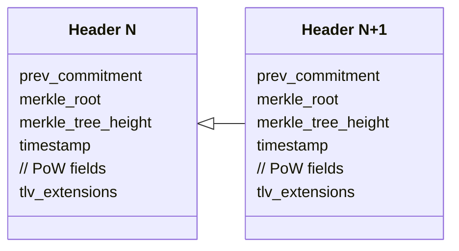
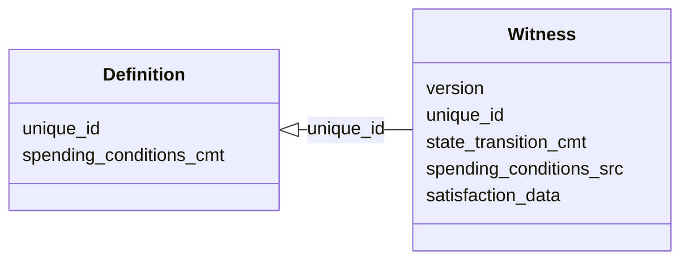

# Scaling and anonymizing Bitcoin at layer 1 with client-side validation

*Maxim Orlovsky, LNP/BP Standards Association*

## Abstract

In the paper we propose a way to upgrade Bitcoin layer 1 (blockchain/timechain) without a required softfork. The upgrade leverages properties of client-side validation, can be gradual, has a permissionless deployment option (i.e. not requiring majority support or miner cooperation) and will have scalability of the order $O(\log N)$ (no zk-proofs) or $O(1)$ (with zk proofs), where $N$ is a global number of transactions. It also offers higher privacy (absence of publically available ledger, transaction graphs, addresses, keys, signatures) and bounded Turing-complete programmability with rich state provided by RGB or other client-side-validated smart contract system.

## Overview

The original implementation of Bitcoin by Satoshi Nakamoto brought the strange idea that everybody needs to verify transactions for the whole world. This idea received the name of **blockchain**, or, sometimes, **timechain** - which became an euphemerism for a ledger with a public access. The introduction of ledger has created two problems: absence of scalability and poor privacy.

Peter Todd in his work [..] has pointed out that for the owners of some state (for instance Bitcoin or any other stateful contract) it is sufficient to verify just part of the history - the part which is directly related to their ownership - and omit the rest. He named his approach **client-side validation**. Giacomo Zucco designed protocol able to create assets with this approach, named **RGB** [..]. In my previous work at LNP/BP Standards Association I was able to develop RGB into the first client-side-validated smart-contract system with rich state and bounded Turing-complete computing; providing sufficient functionality to run anything which can be done with blockchain-based smart contracts - but without a public ledger/blockchain storing any user data; but instead directly utilizing anti-double-spending properties of PoW consensus protocol in Bitcoin. This system was publically developed during the last four years and got released in May 2023 [..].

In the current proposal we demonstrate that Bitcoin, if provided with stateful client-side-validated layer (like RGB), can be upgraded to a system without the limiting properties of public ledger (blockchain), and, while preserving PoW consensus protocol, it can be re-based onto a new scalable non-blockchain layer 1 (codenamed **Prime**). This layer will be able to host a theoretically indefinite number of transactions (at least billions per minute), since the storage of state, computing and the validation will be moved to the client-side-validated layer above. Such design doesn't require Lightning network or other scalability and payment layers on top and scales in the worst-case scenario as $O(\log N)$ (when no zk-proofs are involved) or $O(1)$ (with zk proofs involved), where $N$ is a global number of transactions.

The protocol has three [deployment options](#Deployment) (permissionless, miner-activated and softfork), with the first two not requiring any soft- (or hard-) fork. Options are independent, but can also be deployed in consequent way.

The proposal provides several benefits to Bitcoin as the digital cash:
1. Higher scalability, achieved at the base layer, without the need for Lightning Network or other dedicated scalability solutions;
2. Much improved privacy with now publically exposed transaction graph, ledger, addresses or public keys;
3. Rich programmability, provided by RGB or other client-side-validation system.

The only relative drawbacks of the proposed system are:
1. Instead of downloading blockchain participants must keep track of the updates from miners since a part of the information required for the validation is ephemeral and not persisted by the network. However, a dedicated trustless services may appear, which will cache this information and provide it later for a fee (which prevents unhealthy state of the Bitcoin blockchain where "everybody keeps everything for everybody for free").
2. BTC as currency, once transferred to the Prime in a trustless way, can't be brought back trustlessly without a Bitcoin blockchain softfork providing support for either zk op-codes, drivechains or other other decentralized/trustless unpeg mechanism. Alternatively, if the new system is adopted more than bitcoin blockchain, such unpeg would not be needed at all.

## Design

### Timestamping service

At its foundation Prime runs a timestamping service, creating sequence of headers, each one committing to a Merkle tree root of external client-side-validated data:

Thus, each Prime header has a size independend from the number of transactions contained in the merkle tree of the client-side-validated data.

Each header is equipred with optional TLV extension, which may be used for future protocol upgrades.

Prime doesn't provide any protection from double-spending; these are achieved in the client-side-validated part of the system. The only parts of the Prime which are validated (consensus rules) are:
1) valid commitment to the previous Prime header;
2) valid timestamp (similar to Bitcoin timechain rules);
3) valid PoW (if Prime uses its own consensus as described below).

Prime headers are the only information which is required to be available publically and globally; this can be achieved by using any distributed P2P network. We deliberately do not address the question of P2P network structure in this proposal, since multiple alternative systems may co-exist and compete in market-driven way (based on set of Nostr relays, or utilizing some BIP-324-like dedicated network).

### Proofs

Prime Merkle trees (**ptrees**) is an intermediary and ephemeral structure linking client-side-validated data to the Prime headers. Ptrees are produced by miners and made avaliable to the public via the same or some other means as Prime headers; however, unlike the headers they are not required to persist. Each network user tracks all new ptrees, extract part of the information which is related to the state it owns, saves it into its own stash of client-side-validated data and discads the rest of the ptree. 

Due to the ephemeral nature, absence of validation and no need in knowing ptree content for mining the next header, ptree size doesn't affect system scalability. Thus the ptrees may be of (multiple) gigabyte size, committing to billions and billions of transactions.

The leafs of the trees contain witnesses closing single-use-seals: a mechanism described in details in the next section. Ptrees are constructed according to the multi-protocol deterministic commitment scheme described in [LNPBP-4 standard](https://github.com/LNP-BP/LNPBPs/blob/master/lnpbp-0004.md) and used in RGB today to host comitments in the Bitcoin transactions (both on-chain and inside offchain protocols like lightning). This means that each single-use-seal has a unique predefined placement in the ptree, such that a single merkle path and leaf witness is sufficient to proof the presense - or absence - of a specific single-use-seal instance in the given Prime headers. Users of the protocol from each newly produced ptree extract these proofs for the set of their own single-use-seals which has not being closed yet (analog of UTXO set): in case if they haven't performed an operation these are the proofs of a non-operation (since the witness demonstrates a different single-use-seal being closed at that path). These proofs constitute time-dependent growing part of the client-side-validated history.

#### Scallability considerations

The speed of time-dependent growth in the size of client-side-validated data with ptree proofs is:

$$\sum_t m_t \log N_t,$$

where $t$ is time, $m_t$ is the number of client-defined non-closed single-use-seals at the moment $t$; $N$ is the global number of transactions from $t-1$ to $t$.

This is is logarithmically-slower than with any blockchain, growing with a speed of 

$$\sum_t N_t + M_t,$$

where $M_t$ is the global UTXO set kept in the node memory. It has the following properties: 

$$M_t >> m_t,\\M_t \approx P_t m_t,$$

where $P_t$ is the global number of the system users at momemnt $t$.

The $O(\log N)$ growth speed can be further reduces if a zk-based proof system will be used instead of full Merkle path. This will result in a fixed-size proofs, changing the growth speed to be linear in time $O(t)$ and independent from the number of the global transactions $O(1)$:

$$\sum_t c \cdot m_t,$$

where $c$ is a fixed size of the zk-proof.

### Single-use-seal protocol

Single-use-seal protocol prevents double-spending attacks of the system. 

Single-use-seals (or **seals**) is a special form of cryptographic commitments proposed by Peter Todd [..]. The primitive can be compared to other forms of cryptographic commitments which include hash functions and timestamping:
- cryptographic hash functions allow to prove knowledge of certain fact without revealing the fact beforehand;
- timestamping allow to proof the knowledge of the fact before certain period of time;
- single-use-seals provides an option of creating fututre timestamped commitment, which would be provable singular (i.e. one and only one commitment can be created in the future).

More information about single-use-seals construction is given in the [LNPBP-8 standard](https://github.com/LNP-BP/LNPBPs/blob/master/lnpbp-0008.md). Prime uses a specially-designed form of single-use-seals which is different from the one used in existing protocols (like RGB). 

The definition of a single-use-seal consists of two components: 
- `unique_id`: globally-unique user-generated identifier, which can be deterministically generated from the contract_id, contract operation hash and contract operation output number;
- `spending_conditions_cmt`: commitment (hash) of the conditions under which the seal can be closed in a future (similar to `scriptPubkey` in bitcoin transaction output).

Seals are defined in the client-side-validated smart contract system (RGB or RGB-like). Each seal may has an **assigned state** (as in RGB), for instance BTC balance or any other rich data. When a user likes to update that state - or transfer its ownership to another user, a **state transition** must be prepared, defining new single-use-seal(s) and the new state. Next, a **witness** closing that single-use-seal is constructed, committing to the state transition data and providing source script, matching the spending conditions commitment, and data satisfying that script/conditions. The proposal abstracts from a specific scripting system used (it can be Simplicity, [AluVM](https://aluvm.org) as in RGB today, and hoping not EVM :); scripting engine can be specified using `version` field, such that new engines or opcodes can be introduced over time (see [Upgradability](#Upgradability) section):

The witness is put in explicit form inside a leaf of a ptree and provided to the miners, constructing the ptree and headers. The leaf must be put inside the Merkle tree deterministically regarding the seal `unique_id`, for instance into the slot $$id \mod 2^h,$$ where $h$ is the height of the merkle tree, specified in the Prime header.

Merkle path to the leaf matching `unique_id`, together with the leaf contents (providing witness data) allows to verify that each single-use-seal was closed once and only once in the history of a smart contract - and that it was closed satisfying the scripted conditions. Please note, that the proofs has to be accumulated for each single-use-seal `unique_id` from the time of its definition until the closing - a requirement for proving that the seal was not closed in-between. These proofs, as long they demonstrate different `unique_id`, may omit privacy-sensitive spending conditions source code and satisfaction data, providing just their hash; thus the historical witnesses may be of fixed size. As mentioned before, for the scalability purposes the history of proofs can also be further compressed using zero-knowledge proofs.

## Consensus

Prime, when deployed with [permissionless option](#permissionless-option), requires its own consensus protocol. The security of the protocol is not critical, since it is pegged to Bitcoin PoW security with a dedicated mechanism [described below](#Bitcoin-PoW-anchoring). The only requirement for the consensus is to be censorship-resistant, meaning open set of identity-less miners/validators. The only two consensus protocols known to be satisfying these properties are PoW and [Ouroboros Crypsinous](https://eprint.iacr.org/2018/1132.pdf) variant of BFT consensus cryptoeconomically secured by the [miner rewards](#miner-rewards).

### Miner rewards

The timesequence doesn't mint any cryptocurrency; the miners are rewarded with fees from the day 1. RGB (or other client-side-validated smart contract protocol) defines a dedicated constract for the miner fees,  prividing means of payment, which can be pegged to BTC or a stablecoin. Miners must participate a permissionless anonymous P2P network, where users of the protocols publish their witnesses (not state transitions) equipted with state transitions in the miner contract paying fee to "whoever who mines the next header". Miners include this state transitions in their client-side-valiated history to pass the earned funds as a standard RGB state transition further.

### Bitcoin PoW anchoring

On Bitcoin blockchain an "anyone-can-spent" output with the above-the-dust amount of bitcoins is created. The information about this UTXO becomes a part of the Prime genesis and serves as a definition of a mining single-use-seal. A miner solving Prime PoW must spend that output and inside the spending bitcoin transaction provide a [Tapret commitment](https://github.com/LNP-BP/LNPBPs/blob/master/lnpbp-0012.md) to the mined Prime header and a new "anyone-can-spend" single-use-seal for the next miner. This anchors the created Prime to the bitcoin blockchain in a unique way, such that the valid Prime is the one which follows this sequence of single-use-seals.

If a party spends current miner single-use-seal without creating a commitment - or commiting to a Prime header without sufficient PoW, such closing is considered invalid; in this case any party is allowed to create a special bitcoin transaction providing publically-identifiable OP_RETURN information ("announcement") about a new miner single-use-seal ("protocol reset"); only the first OP_RETURN announcement which was closed with a proper procedure is considered valid under the Prume consensus rules.

PoW single-use-seal anchoring represents a full consensus protocol which can be run by Prime without any other additional consensus (PoW or BFT). Alternatively, it can be combined with a secondary Prime consensus with a rule that unless the security of the Prime consensus protocol is lower that Bitcoin PoW security the Bitcoin PoW has a priority, with automatic switch back to the Prime consensus as a primary consensus when this condition is not met.

## Delpolyment

We see three steps in the proposal to be adopted by Bitcoin, gradually solving tradeoffs of the upgrade. Each of the steps is optional; the system can operate without any one or two of them.

### Permissionless option

Prime can be launched independently from Bitcoin timechain, with Timechain consensus pegged to the security of Bitcoin PoW via a dedicated mechanism based on single-use-seals (which we describe in the paper). This doesn't require any changes on the miner side or any Bitcoin soft/hardforks, however with this setup BTC can be transferred to the new system trustlessly only in one way -- and the other way will require a federation.

### Miner-activated non-fork

Bitcoin miners add commitments to Prime headers to the Bitcoin blockchain coinbase data - like in merged mining. This removes the need for a dedicated Prime consensus.

### Bitcoin soft-fork

Bitcoin softfork supporting the trustless move of Bitcoin from Prime to timechain, optimally as an OP-code enabling ZK proofs.

## Upgradability

TBD